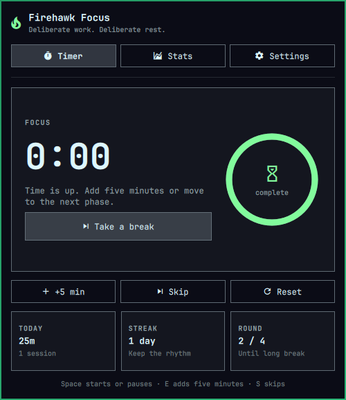

# Firehawk Focus

A visual, local-first focus timer built for the [Omarchy](https://omarchy.org/) bar. Firehawk Focus combines deliberate focus/break transitions, interruption-aware analytics, configurable completion alerts, and automatic focus-only Do Not Disturb.

<p align="center">
  
</p>

## Features

- Focus, short-break, and earned long-break rounds
- Manual decisions at zero: start the next phase or add five minutes
- Non-invasive and invasive completion modes
- Optional alarm sound and desktop notification
- Automatic Do Not Disturb during focus, with previous state restoration
- Partial-session accounting when focus is interrupted
- Seven-day chart, daily totals, streaks, rounds, and recent sessions
- Configurable durations and rounds per long break
- Local persistence with no account, network service, or cloud synchronization
- Omarchy theme integration

## Install

Firehawk Focus is an unsandboxed Omarchy shell plugin. Review third-party plugin code before enabling it.

```sh
omarchy plugin add https://github.com/LordFirehawk/omarchy-firehawk-focus.git --enable
```

The interactive installer validates the manifest and asks where to place the widget. To move it later:

```sh
omarchy bar move lordfirehawk.focus --section center
```

### Update

```sh
omarchy plugin update lordfirehawk.focus
```

### Remove

```sh
omarchy plugin remove lordfirehawk.focus
```

## Requirements

- A current Omarchy release with the shell plugin system
- `notify-send` for desktop completion notifications
- `canberra-gtk-play` for completion sounds

The notification and sound integrations can each be disabled in Settings.

## Controls

- **Left-click:** open or close the panel
- **Right-click:** start, pause, or resume
- **Middle-click:** reset the timer
- **1 / 2 / 3:** Timer, Stats, and Settings tabs
- **Space:** start or pause
- **E:** add five minutes
- **S:** skip

## Completion behavior

### Non-invasive

Plays the configured alarm and shows a temporary desktop notification. The completed phase waits at zero for you to extend it or start the next phase.

### Invasive

Plays the alarm, opens the full panel, and holds at zero until dismissed. Choose **+5 min** to resume the same phase, **Take a break** after focus, or **Start Focus** after a break.

A running break also provides **Start Focus** so it can be ended early in one click.

## Interruptions and analytics

Leaving a started focus block through **Skip** or **Take a break** records its actual elapsed time as a partial session and advances the round counter. An interrupted fourth focus therefore still earns the configured long break. Paused time is excluded, and skipping a timer that was never started does not create a phantom session.

## Privacy and local data

Timer state, settings, and history are stored locally at:

```text
~/.local/state/omarchy/firehawk-focus.json
```

Removing the plugin does not automatically remove this history.

## Script control

```sh
omarchy-shell lordfirehawk.focus open
omarchy-shell lordfirehawk.focus close
omarchy-shell lordfirehawk.focus begin
omarchy-shell lordfirehawk.focus pause
omarchy-shell lordfirehawk.focus extend
omarchy-shell lordfirehawk.focus skip
omarchy-shell lordfirehawk.focus breakNow
omarchy-shell lordfirehawk.focus focusNow
omarchy-shell lordfirehawk.focus reset
omarchy-shell lordfirehawk.focus status
```

## Development

Run the dependency-free state-model test anywhere Node.js is available:

```sh
node test/model.test.js
```

On Omarchy, run the complete plugin validation suite:

```sh
./test/all
```

## License

[MIT](LICENSE) © 2026 LordFirehawk
